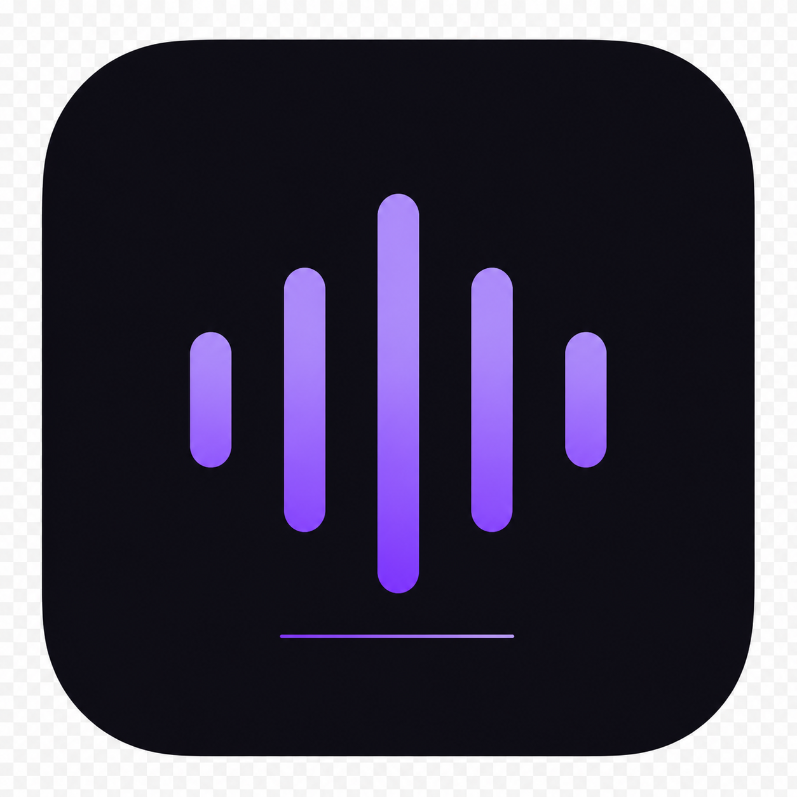

<div align="center">

<br/>


 
<h1>WeSpR</h1>

<p><strong>Transcription audio et vidéo — 100% locale, 100% privée.</strong><br/>
Propulsé par <a href="https://github.com/ggml-org/whisper.cpp">whisper.cpp</a> · macOS · Aucun compte requis</p>

<p>
  
  
  
  
  
</p>

<br/>

</div>

---

## Ce que fait WeSpR

WeSpR transcrit vos fichiers audio et vidéo directement sur votre Mac. Rien ne quitte votre machine — pas de serveur, pas de clé API, pas de compte.

Glissez un fichier. Choisissez un modèle. Récupérez le texte.

<br/>

<table>
<tr>
<td width="50%">

**Formats d'entrée**

MP3, WAV, M4A, FLAC, OGG, MP4, MOV, MKV, AVI, WEBM — et tout ce que ffmpeg supporte.

</td>
<td width="50%">

**Formats de sortie**

TXT brut, TXT horodaté, SRT, VTT, Markdown, JSON structuré.

</td>
</tr>
<tr>
<td>

**Modèles disponibles**

Tiny (75 Mo) → Large-v3 (3.1 Go). Variantes anglais optimisées. Diarisation (identification des locuteurs) avec les modèles `-tdrz`.

</td>
<td>

**Vie privée totale**

Zéro telemetry. Zéro analytics. Zéro réseau à l'usage. Les logs restent dans `~/Library/Logs/WeSpR/`.

</td>
</tr>
</table>

---

## Installation

### Téléchargement direct

Téléchargez le dernier `.dmg` depuis la [page Releases](https://github.com/K1000-B/wespr/releases).

```
WeSpR-{version}-universal.dmg   →   Double-cliquez, glissez dans Applications.
```

> **Note sécurité macOS** : l'app n'est pas notarisée en v1. Au premier lancement, faites clic droit → Ouvrir plutôt que double-clic, ou exécutez :
> ```bash
> xattr -cr /Applications/WeSpR.app
> ```

### Premier lancement

Au démarrage, WeSpR télécharge automatiquement les modèles **Whisper Small** (466 Mo) et **Whisper Small EN** (466 Mo) depuis HuggingFace. La progression est affichée en temps réel. Vous pouvez ignorer cette étape et installer d'autres modèles plus tard dans Réglages.

---

## Modèles Whisper

| Modèle | Taille | Langues | Vitesse | Précision | Notes |
|--------|--------|---------|---------|-----------|-------|
| Tiny | 75 Mo | 99 | ●●●●● | ●● | Test rapide |
| Base | 142 Mo | 99 | ●●●● | ●●● | |
| **Small** ★ | 466 Mo | 99 | ●●● | ●●●● | **Défaut** |
| Small EN | 466 Mo | 🇬🇧 | ●●● | ●●●● | Optimisé anglais |
| Small EN-tdrz | 466 Mo | 🇬🇧 | ●●● | ●●●● | + Diarisation |
| Medium | 1.5 Go | 99 | ●● | ●●●● | |
| Large-v3 | 3.1 Go | 99 | ●● | ●●●●● | Qualité studio |
| Large-v3-Q5 | 1.1 Go | 99 | ●●● | ●●●●● | Quantized, moins de RAM |
| Large-v3-Turbo | 1.6 Go | 99 | ●●●●● | ●●●●● | 8× plus rapide que Large |

Les modèles se téléchargent depuis [HuggingFace — ggerganov/whisper.cpp](https://huggingface.co/ggerganov/whisper.cpp) et sont stockés dans `~/Library/Application Support/WeSpR/models/`.

---

## Build depuis les sources

### Prérequis

- macOS 12+
- Node.js 20+
- Xcode Command Line Tools : `xcode-select --install`
- CMake : `brew install cmake`
- p7zip : `brew install p7zip`
- GitHub CLI : `brew install gh`

### Setup

```bash
# Cloner
git clone https://github.com/K1000-B/wespr.git
cd wespr

# Installer les dépendances Node
npm install

# Compiler whisper-cli + télécharger ffmpeg statique
# (prend ~10 min à la première exécution)
npm run postinstall
```

### Développement

```bash
npm run dev          # Electron + Vite en mode watch
```

### Build distribution

```bash
npm run dist         # Génère dist/WeSpR-{version}-universal.dmg
```

---

## Architecture

```
Electron Main Process          Renderer Process (React)
─────────────────────          ────────────────────────
ffmpeg.ts                      Home.tsx        (drop zone + options)
whisper.ts          ←─ IPC ─→  Result.tsx      (viewer + export)
segmenter.ts        preload    Settings.tsx    (modèles + préfs)
merger.ts
modelManager.ts
cleanup.ts
```

Le renderer n'a aucun accès Node.js direct. Tout passe par `window.wespr.*` exposé via preload avec `contextIsolation: true`.

Le pipeline de transcription découpe les fichiers en **segments de 55 secondes** (overlap 2s) avant de les envoyer à whisper-cli, ce qui élimine les hallucinations sur les longs fichiers.

---

## Contribuer

Les contributions sont bienvenues. Lisez [`AGENTS.md`](AGENTS.md) avant d'ouvrir une PR — il documente les conventions de commit, les règles d'architecture et les contraintes de design.

```bash
# Fork + clone
gh repo fork K1000-B/wespr --clone
cd wespr

# Nouvelle branche
git checkout -b feat/ma-fonctionnalite

# Développer, committer (conventional commits)
git commit -m "feat(export): add DOCX format"

# Ouvrir une PR
gh pr create --web
```

---

## Licence

MIT — voir [`LICENSE`](LICENSE).

Les modèles Whisper sont distribués sous licence MIT par OpenAI.
ffmpeg est distribué sous LGPL 2.1+.
whisper.cpp est distribué sous MIT par Georgi Gerganov.

---

<div align="center">
<sub>Fait avec ♥ et whisper.cpp · Aucune donnée ne quitte votre Mac</sub>
</div>